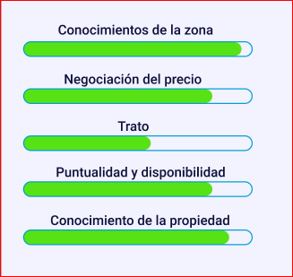
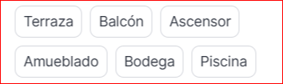

# Implementación de página de registro de agencias

## Características implementadas

Hemos creado una nueva implementación de la funcionalidad de registro reemplazando el anterior modal por una página dedicada con URL única (`/register`). Esta implementación incluye:

1. Un selector de "Tipo de perfil" con tres opciones:
   - "Anunciarme como agente" (registra un agente normal)
   - "Anunciar mi agencia" (registra un administrador con acceso a funciones de agencia)
   - "Añadir red de agencias" (similar al anterior pero para redes de agencias)

2. Interfaz mejorada:
   - Diseño de dos columnas con formulario a la izquierda e información/beneficios a la derecha
   - Campos para email y contraseña con validación
   - Navegación simplificada entre login y registro

3. Redirección inteligente tras el registro:
   - Los usuarios administradores son dirigidos a la sección de perfil de agencia
   - Los agentes normales son dirigidos a la sección de perfil de agente

## Estructura del código

La implementación se compone de:

1. Nuevas páginas:
   - `client/src/pages/register.tsx` - Página de registro
   - `client/src/pages/login.tsx` - Página de login

2. Actualizaciones:
   - `client/src/App.tsx` - Añadidas rutas para las nuevas páginas
   - `client/src/components/Navbar.tsx` - Actualizado para enlazar a las nuevas páginas
   - `client/src/pages/manage.tsx` - Actualizado para recibir parámetros de URL y mostrar la sección apropiada
   - `client/src/contexts/user-context.tsx` - Actualizada la interfaz User para incluir el campo isAdmin

## Flujo de datos

Cuando un usuario se registra:
1. Selecciona un tipo de perfil (agente, agencia o red)
2. Completa su email y contraseña
3. Al enviar el formulario, se crea un usuario con el flag `isAdmin` activado para los que eligieron agencia o red
4. Tras el registro exitoso, el usuario es redirigido a la sección apropiada de la página de gestión
5. Si es un administrador, se muestra directamente la sección "Perfil agencia"

## Capturas de pantalla

### Página de registro

### Selector de tipo de perfil

### Página de inicio de sesión
